# CLI Shop GUI Application

## Overview
This is a command-line interface (CLI) based GUI shop application built using C# and .NET 9.0. It provides a terminal-based graphical user interface powered by `Terminal.Gui` for managing an e-commerce platform. The application supports user authentication, product management, cart operations, order processing, and warehouse management, with a SQLite database for data persistence.

## Features
- **User Authentication**: Login and signup functionality for users.
- **Product Management**: Add, edit, and view products and categories.
- **Cart and Orders**: Add products to cart and place orders.
- **Warehouse Management**: Manage inventory and stock.
- **Reports**: View user and order reports.
- **Responsive CLI GUI**: Built with `Terminal.Gui` for a rich terminal-based interface.
- **Database**: Uses SQLite with Entity Framework Core for data storage.

## Screenshots
Below are some screenshots of the application:
[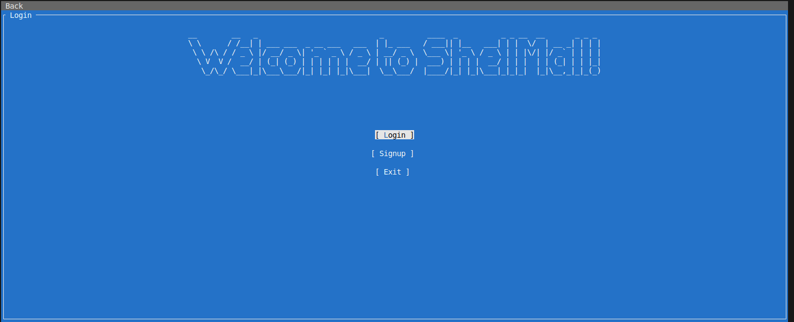](../images/App/landing.png)
[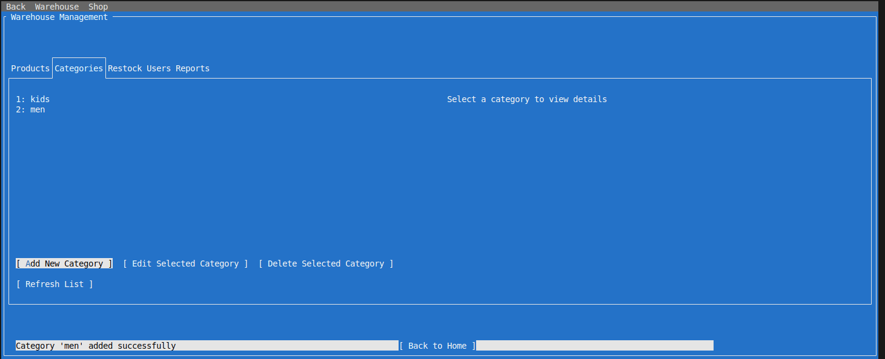](../images/App/categories.png)
[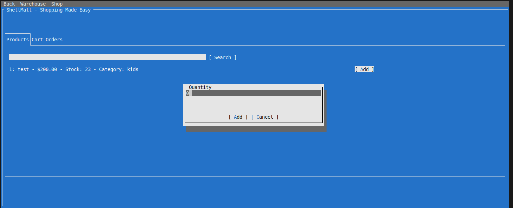](../images/App/add_to_cart.png)
[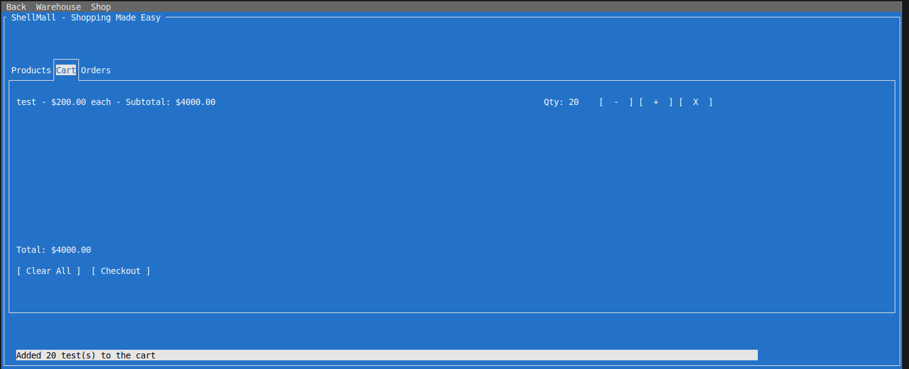](../images/App/cart.png)
[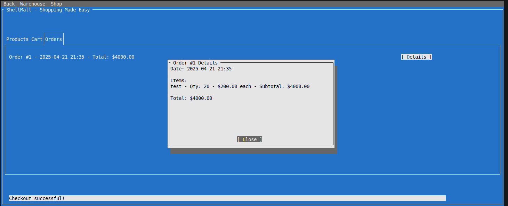](../images/App/orders.png)
[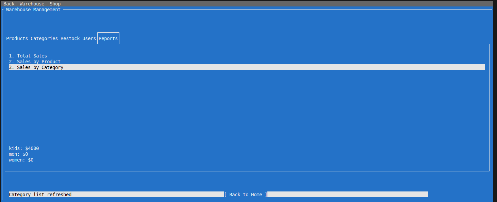](../images/App/reports.png)
[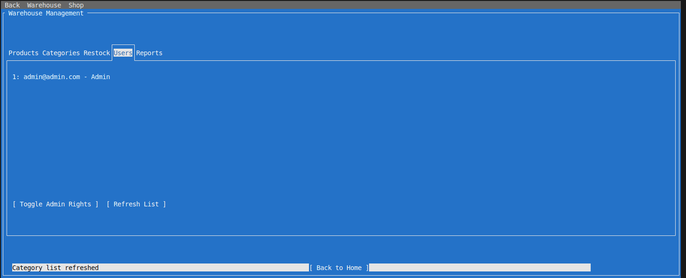](../images/App/users.png)
[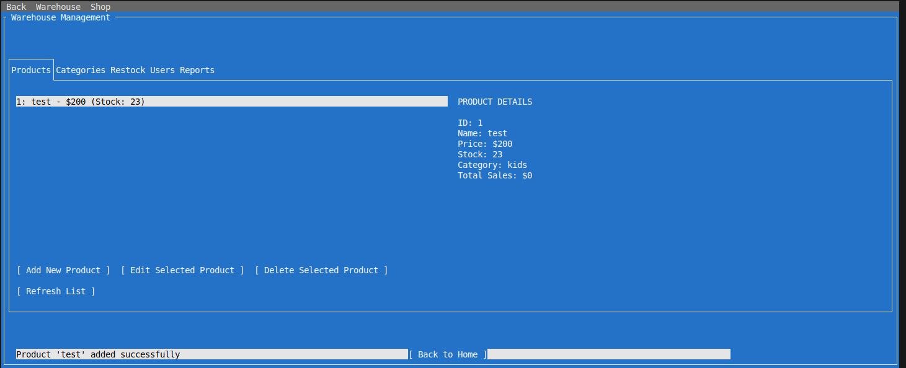](../images/App/view_product.png)
[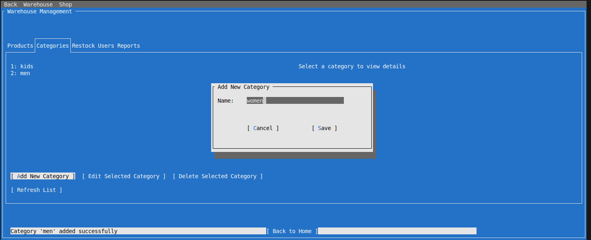](../images/App/add_category.png)
[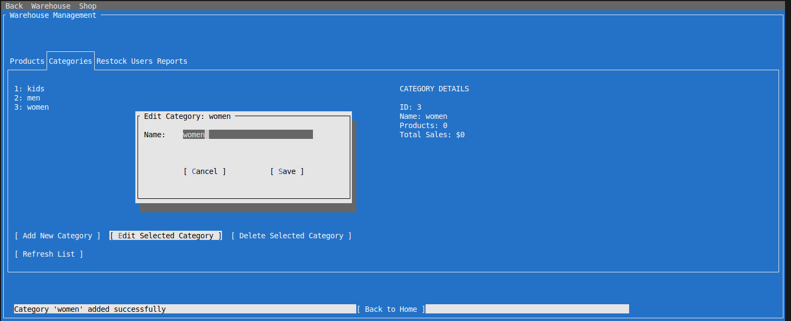](../images/App/edit_category.png)
[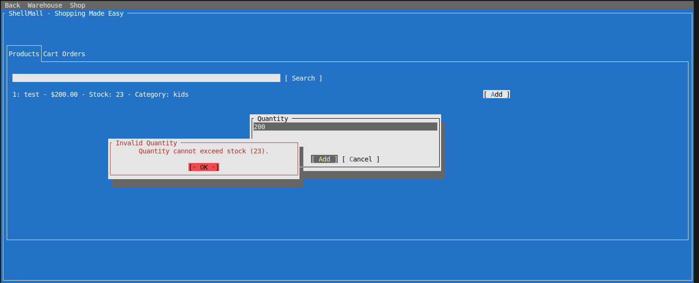](../images/App/error_adding_to_cart.png)
[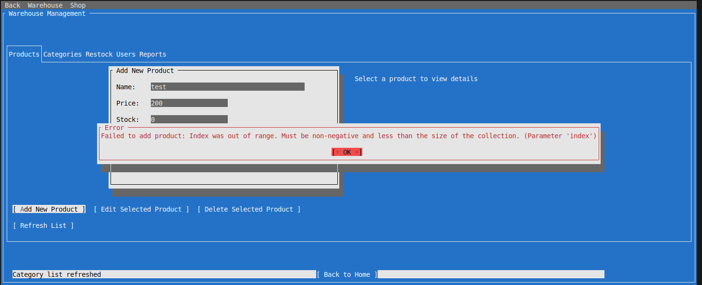](../images/App/error_create_product.png)

## Project Structure
```
.
├── App.csproj                   # Project file
├── App.sln                      # Solution file
├── app.db                       # SQLite database
├── Data/                        # Database context and management
│   ├── AppDbContext.cs
│   ├── AppDbContextFactory.cs
│   └── DbContextManager.cs
├── Migrations/                  # EF Core migrations
│   ├── 20250421144945_AddECommerceEntities.cs
│   ├── 20250421163846_UpdateProductSchema.cs
│   ├── 20250421183153_UpdateProductWithCategory.cs
│   └── AppDbContextModelSnapshot.cs
├── Models/                      # Data models
│   ├── Cart.cs
│   ├── Order.cs
│   ├── Product.cs
│   └── User.cs
├── Pages/                       # UI pages
│   ├── HomePage.cs
│   ├── LandingPage.cs
│   ├── LoginPage.cs
│   ├── Page.cs
│   ├── SignupPage.cs
│   └── WarehousePage.cs
├── Routes/                      # Navigation routing
│   ├── Route.cs
│   └── Router.cs
├── Services/                    # Business logic
│   ├── AuthService.cs
│   ├── GlobalStore.cs
│   ├── ShopService.cs
│   └── WarehouseService.cs
├── Utils/                       # Utility classes
│   ├── GlobalMenuBar.cs
│   ├── Print.cs
│   └── UIHelper.cs
├── Program.cs                   # Application entry point
├── Dockerfile                   # Docker configuration
├── images/App/                   # Application screenshots
│   ├── add_category.png
│   ├── add_to_cart.png
│   ├── cart.png
│   ├── categories.png
│   ├── edit_category.png
│   ├── error_adding_to_cart.png
│   ├── error_create_product.png
│   ├── landing.png
│   ├── orders.png
│   ├── reports.png
│   ├── users.png
│   └── view_product.png
└── bin/                         # Compiled binaries
```

## Prerequisites
- [.NET 9.0 SDK](https://dotnet.microsoft.com/download/dotnet/9.0)
- SQLite (included via `Microsoft.EntityFrameworkCore.Sqlite`)
- Terminal supporting ANSI escape codes (e.g., Windows Terminal, Linux/macOS terminals)

## Installation
1. **Clone the Repository**:
   ```bash
   git clone <repository-url>
   cd <repository-directory>
   ```

2. **Restore Dependencies**:
   ```bash
   dotnet restore
   ```

3. **Build the Project**:
   ```bash
   dotnet build
   ```

4. **Run the Application**:
   ```bash
   dotnet run
   ```

## Docker Support
A `Dockerfile` is provided to containerize the application. To build and run the application using Docker:

1. **Build the Docker Image**:
   ```bash
   docker build -t cli-shop-gui .
   ```

2. **Run the Docker Container**:
   ```bash
   docker run -it cli-shop-gui
   ```

## Dependencies
- `Terminal.Gui`: For CLI-based GUI rendering.
- `Microsoft.EntityFrameworkCore.Sqlite`: For SQLite database integration.
- `Spectre.Console`: For enhanced console output formatting.
- `Figgle`: For ASCII art generation.
- `Humanizer`: For human-readable data formatting.

## Database Setup
The application uses a SQLite database (`app.db`). To set up the database:

1. Apply migrations to create the database schema:
   ```bash
   dotnet ef database update
   ```

2. The database file (`app.db`) will be created in the project root.

## Usage
- **Login/Signup**: Start the application and use the login or signup page to authenticate.
- **Navigate**: Use the menu bar or keyboard shortcuts to navigate between pages (e.g., Home, Warehouse, Cart).
- **Manage Products**: Add, edit, or view products and categories.
- **Place Orders**: Add items to the cart and complete the checkout process.
- **View Reports**: Access user and order reports from the reports page.

## Contributing
Contributions are welcome! Please follow these steps:
1. Fork the repository.
2. Create a new branch (`git checkout -b feature-branch`).
3. Make your changes and commit (`git commit -m "Add feature"`).
4. Push to the branch (`git push origin feature-branch`).
5. Open a pull request.

## License
This project is licensed under the MIT License. See the `LICENSE` file for details.

## Contact
For issues or questions, please open an issue on the repository or contact the maintainer.