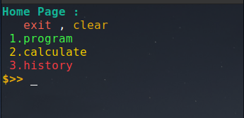
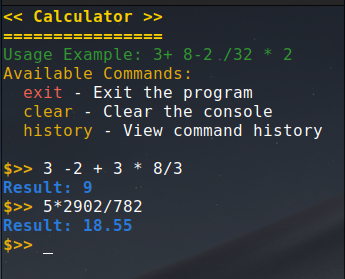
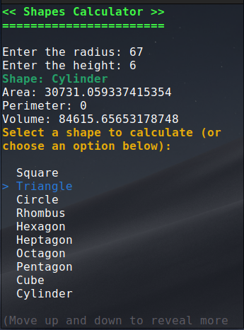
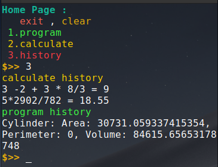

# Project Overview

This project is a C# application that involves a basic calculator and shape calculator functionalities. The application is containerized using Docker and utilizes a solution structure with multiple directories to organize its components.

## Features

### 1. **Calculator**:

- A basic calculator that supports fundamental operations like addition, subtraction, multiplication, and division.

### 2. **Shape Calculator**:

- A specialized calculator to compute areas and perimeters of different geometric shapes.

### 3. **History**:

- A history feature that tracks and displays past calculations, helping users keep track of their work.

## Images

[](images/home.png)

[](images/calc.png)

[](images/shapes.png)

[](images/history.png)

## Technologies

- **C# (.NET 9.0)**: The primary programming language for building the application.
- **Docker**: Used to containerize the application for easy deployment and management.
- **Spectre.Console**: A library used for building interactive console applications.

## Docker

The project includes a `Dockerfile` that allows the application to be built and run inside a Docker container. This ensures consistent environments across different development setups.

## Setup

To set up the project locally, follow the steps below:

### 1. Clone the repository:

```bash
git clone https://github.com/2Hasan2/project-cs-1.git
cd project-cs-1
```

### 2. Build the Docker container:

If you want to build the Docker container:

```bash
docker build -t project1 .
```

### 3. Run the application inside a Docker container:

```bash
docker run -it project1
```

Alternatively, use the `compose.yaml` file to manage services if you plan on using Docker Compose.

## Directory Breakdown

- **project1**: The main project folder containing all the necessary code, models, and pages.
  - **bin/Debug/net9.0**: Contains the compiled application binaries.
  - **Models**: Defines the application models such as `Shape.cs`.
  - **Pages**: Includes pages like the `Calculator.cs` and `ShapesCalc.cs`.
  - **Store**: Contains application state management files like `History.cs`.

## Contribution

Feel free to fork the repository and submit issues or pull requests for any improvements or bug fixes.
