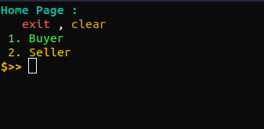
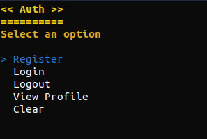
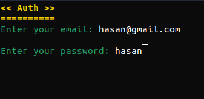
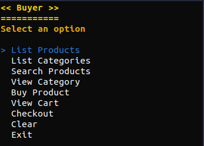
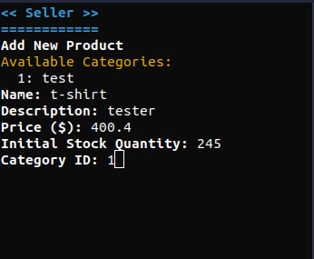
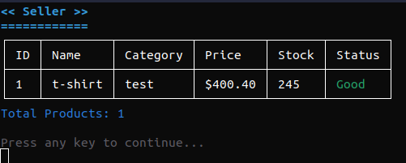
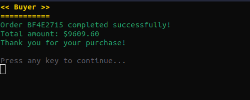

# Project Overview

This project is a C# application that involves a point of sale (POS) system with a focus on user authentication and product management. The application is designed to be run in a console environment and utilizes Docker for containerization. It features two main users : **Seller** and **Buyer**.

## Features

### 1. **Seller**:
- A page that allows the user to input category, product name, and price,
and manage it.

### 2. **Buyer**:
- A page that allows the user to shop for products, view the cart, and manage the checkout process.

### 3. **Auth**:
- A page that allows the user to register and login.

## Images

[](../images/home2.png)

[](../images/auth.png)

[](../images/login.png)

[](../images/seller.png)

[](../images/buyer.png)

[](../images/addProduct.png)

[](../images/listProducts.png)

[](../images/checkout.png)

## Technologies

- **C# (.NET 9.0)**: The primary programming language for building the application.
- **Docker**: Used to containerize the application for easy deployment and management.
- **Spectre.Console**: A library used for building interactive console applications.
- **EntityFrameworkCore**: An ORM framework for .NET, used for database operations.
- **SQLite**: A lightweight database engine used for data storage.

## Docker

The project includes a `Dockerfile` that allows the application to be built and run inside a Docker container. This ensures consistent environments across different development setups.

## Setup

To set up the project locally, follow the steps below:

### 1. Clone the repository:

```bash
git clone https://github.com/2Hasan2/project-cs-1.git
cd project-cs-1/project2
```

### 2. Build the Docker container:

If you want to build the Docker container:

```bash
docker build -t project2 .
```

### 3. Run the application inside a Docker container:

```bash
docker run -it project2
```

Alternatively, use the `compose.yaml` file to manage services if you plan on using Docker Compose.

## Directory Breakdown

- **project2**: The main project folder containing all the necessary code, models, and pages.
  - **bin/Debug/net9.0**: Contains the compiled application binaries.
  - **Models**: Defines the application models such as `Product.cs`, `User.cs`, and `Category.cs`.
  - **Pages**: Includes pages like the `Auth.cs`, `Seller.cs`, and `Buyer.cs` that define the user interface and interactions.
  - **Services**: Contains the `ProductService.cs` and `UserService.cs` for handling database operations and business logic.

## Contribution

Feel free to fork the repository and submit issues or pull requests for any improvements or bug fixes.
